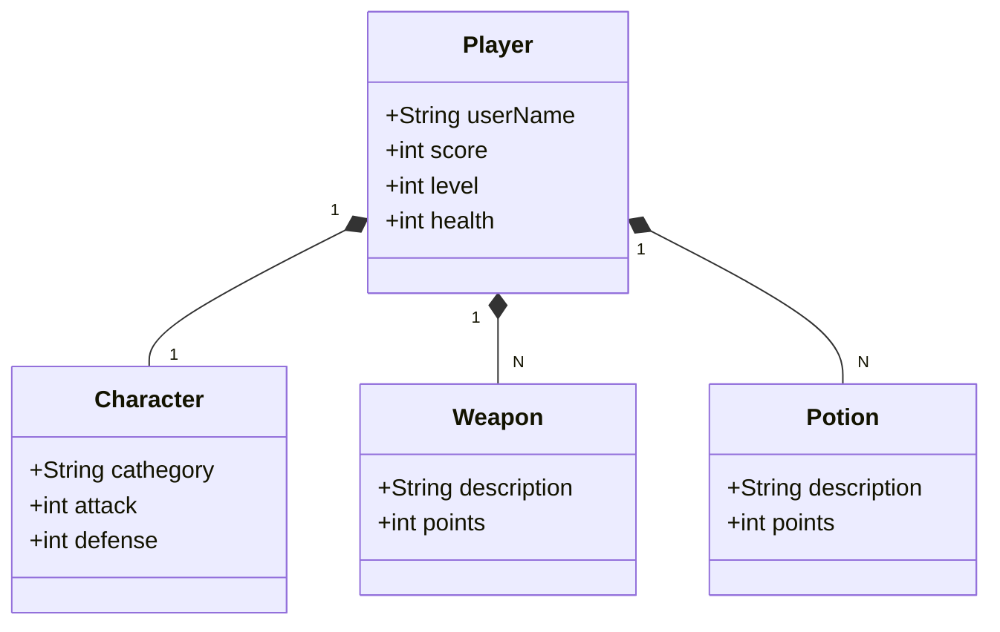

# Desafio DIO - Publicando API REST na Nuvem

```mermaid
classDiagram
    class Player {
        +String userName
        +int score
        +int level
        +int health
    }

    class Character {
        +String cathegory
        +int attack
        +int defense
    }

    class Weapon {
        +String description
        +int points
    }

    class Potion {
        +String description
        +int points
    }

    Player "1" *-- "1" Character
    Player "1" *-- "N" Weapon
    Player "1" *-- "N" Potion
```
